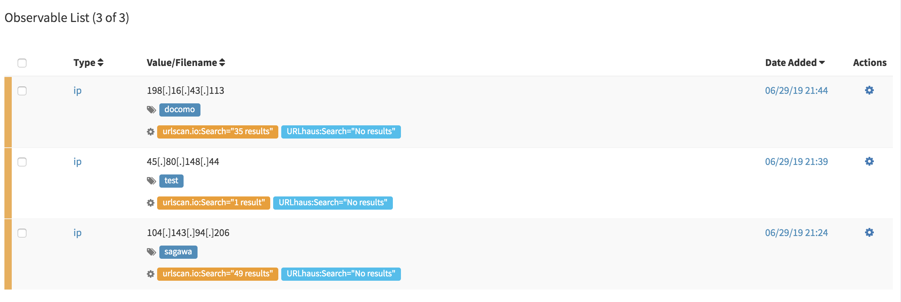

# Cortex urlscan.io analyzer

[Cortex analyzer](https://github.com/TheHive-Project/Cortex-Analyzers) for urlscan.io.

## How to install

- Copy `urlscan` directory to `/path/to/analyzers/`.
- Run `pip3 install -r requirements.txt`.
- Set templates (`templates/long.html` and `templates/short.html`) via TheHive Web UI.

## Screenshots

### Short report (short.html)

### Long report (long.html)

